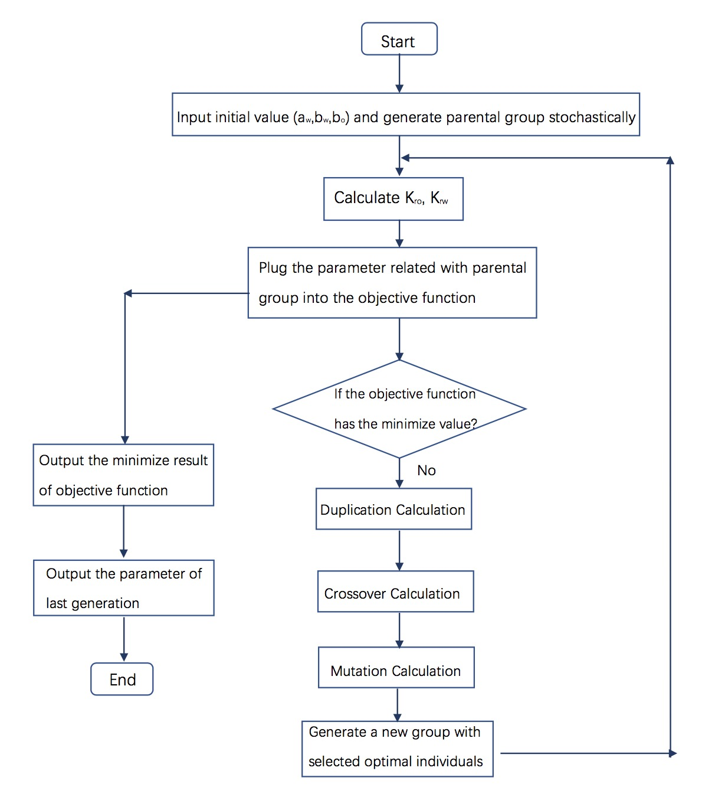

## Two-phase Relative Permeability Based on Production

The project for Undergraduate Graduation Thesis.

Inverse two-phase relative permeability using Genetic Algorithm. 

### Requirements

1. [Matlab 2016](https://www.mathworks.com/products/matlab.html)  or later
2. Windows System

### Data

1. Production data `DATA.mat` .
2. Measured permeability curve  `DATA2.mat` .

### Setup

Run `main.m` in Matlab Software.

### Algorithm Flow Chart

